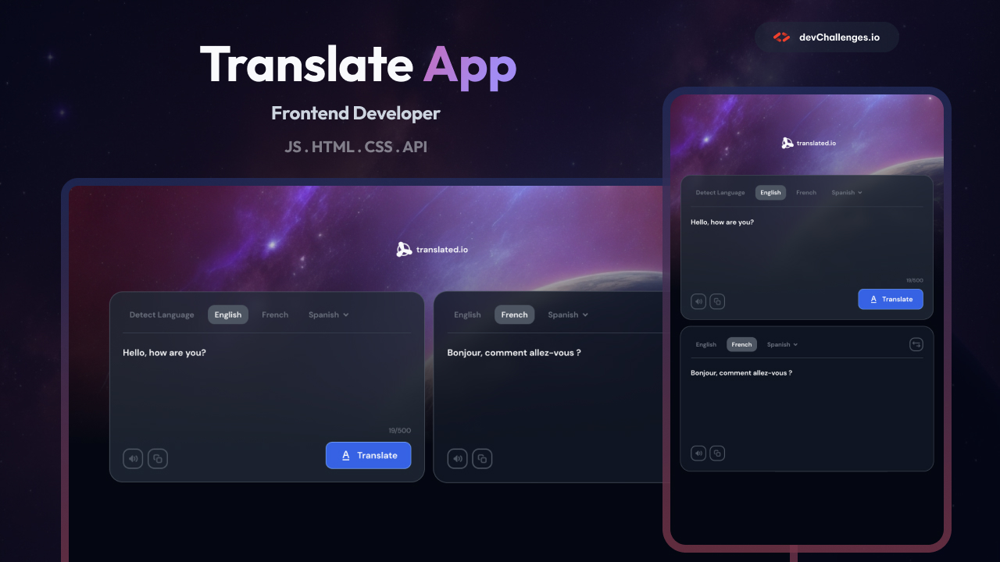

# DevChallenges.io - Translate app

## Welcome! 👋

Welcome to this responsive web coding challenge.

[devChallenges.io](https://devchallenges.io/) challenges are designed to help you enhance your coding skills by building realistic projects.

**Suggested Skills to practice: HTML and CSS**

## The challenge

Your task is to create a web page that closely resembles the provided design.

You can use any tools or resources you like to complete this challenge. Each challenge is designed to practice different skills, so be sure to check the challenge description for more information.

If you need help or have any questions, feel free to [join our community](https://github.com/orgs/devchallenges-io/discussions) and ask for support.

## Where to find everything

Your goal is to build the project using the provided design. You can find the designs in the challenge editor once you start the challenge or in the `/design` folder. Please note that the `/design` folder may not include all the designs you need, so be sure to check the editor for more details.

The designs are in JPG format, so you'll need to use your best judgment for styles such as `font-size`, `padding`, and `margin`. Additionally, spacing guides are available for each challenge, but access to them requires a [Pro membership](https://devchallenges.io/pro). With a Pro membership, you can also download the Figma design files.

All the required assets can be found in the `/resources` folder. You may need to optimize the assets as necessary.

For more information about the challenge, access the challenge editor on [devChallenges.io](https://devchallenges.io/challenges-dashboard).

## Steps to Complete the Challenge on devChallenges.io

- [ ] Start by visiting [devChallenges.io](https://devchallenges.io/), navigate to the challenge page, and begin the challenge.
- [ ] Once you have started the challenge, you will have access to the editor where you can download the necessary resources, check colors, fonts, and more.
- [ ] Download the starter/resources, and if you are a Pro user, you can also download the Figma file.
- [ ] Initialize the project as a Git repository.
- [ ] Review the design and analyze the different versions for desktop, tablet, and mobile.
- [ ] Plan your approach to the project by identifying reusable CSS classes and structuring your HTML content.
- [ ] Define the base styles for your project, including font-family, font-size, and other general content styles.
- [ ] Begin adding styles from the top of the page and work your way down, ensuring that each section is visually appealing and matches the provided design.
- [ ] Optimize and resize the required assets from the `/images` folder as necessary.
- [ ] Test your project's responsiveness by previewing it on different devices and screen sizes.
- [ ] Once you are satisfied with your implementation, deploy your project to a hosting platform such as GitHub Pages, Vercel, or Netlify.
- [ ] Submit your solution on devchallenges.io and aim to pass the design comparison and performance tests.
- [ ] Replace the default `README.md` file with a custom one that explains your project and reflects on your learning experience. You can use the provided `README-template.md` as a starting point.
- [ ] Share your solution with the devChallenges.io community by tweeting [@devchallengesio](https://twitter.com/devchallengesio) and mentioning the repository and live URLs in your tweet. You can also share your solution on other social channels or write a blog post about your experience.
- [ ] Seek feedback from the community by using the provided templates or asking specific questions about your implementation.

Good luck and enjoy building your project! 🚀

## Deploying your project

Our recommended hosting options include:

- [GitHub Pages](https://pages.github.com/)
- [Vercel](https://vercel.com/)
- [Netlify](https://www.netlify.com/)

You can choose any of these solutions or explore other trusted providers. For more information, please refer to our guide on [free hosting platforms](https://devchallenges.io/learn/1-fundamentals/free-hosting-for-web-projects).

## Create your own `README.md`

To use the Readme template, follow these steps:

1. Open the `README-template.md` file in your text editor.
2. Replace the placeholder content with your own project information.
3. Customize the sections and headings to fit your project's needs.
4. Add a detailed description of your project, including its purpose and features.
5. Reflect on your learning experience and any challenges you encountered during development.
6. Delete the original `README.md` file.
7. Rename the `README-template.md` file to `README.md`.
8. Save the changes and commit the updated `README.md` file to your repository.

By following these instructions, you can create a customized `README.md` file that effectively communicates your project to others.

## More guides

Don't forget to check out the [devChallenges Curriculum](https://devchallenges.io/learn), which covers basic to advanced topics that are essential for your web development journey.

## Sharing your solution

There are several platforms where you can share your solution:

1.  Tweet [@devchallengesio](https://x.com/devchallengesio) and mention **@devchallengesio**, including the repository and live URLs in your tweet. We would love to see what you have built and help spread the word.
2.  Share your solution on other social channels such as LinkedIn and tag [devchallenges](https://www.linkedin.com/company/devchallenges).
3.  Write a blog post about your experience building the project. Documenting your workflow, technical choices, and explaining your code is an excellent way to reinforce your learning. Popular platforms for writing include [dev.to](https://dev.to/), [Hashnode](https://hashnode.com/), and [CodeNewbie](https://community.codenewbie.org/).

We provide templates to help you share your solution once you have submitted it on the platform. Feel free to edit them and include specific questions when seeking feedback.

The more specific your questions are, the more likely it is that another community member will provide feedback.

## Feedback

We value feedback and are always looking to improve our challenges and platform. If you have any suggestions or comments, please email us at hi\[at]devchallenges\[dot]io.

This challenge is completely free. Please share it with anyone who would find it useful for practice.

**Enjoy building!** 🚀
